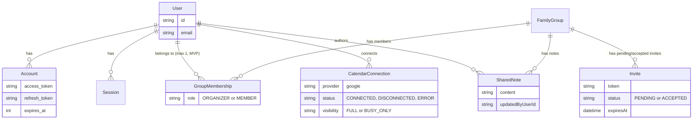

# Database Schema

This explains the relationships and reasoning behind `schema.prisma`. The README's "Database Schema & Relationships" section is a short summary for outside readers — this is the deeper, source-of-truth version for working in this folder.

## Contents
- [Entity relationship diagram](#entity-relationship-diagram)
- [Relationship types at a glance](#relationship-types-at-a-glance)
- [Identity: User / Account / Session / VerificationToken](#identity-user--account--session--verificationtoken)
- [FamilyGroup ↔ GroupMembership ↔ User](#familygroup--groupmembership--user)
- [Invite — intentionally decoupled from GroupMembership](#invite--intentionally-decoupled-from-groupmembership)
- [CalendarConnection — connection metadata only, never event data](#calendarconnection--connection-metadata-only-never-event-data)
- [SharedNote — many per group, no edit, no history table](#sharednote--many-per-group-no-edit-no-history-table)
- [What's notably not in this schema](#whats-notably-not-in-this-schema)

## Entity Relationship Diagram

Note: `GroupMembership` is the join table between `User` and `FamilyGroup` — it's drawn above as two separate one-to-many relationships (User→GroupMembership, FamilyGroup→GroupMembership) because that's literally how the foreign keys work, but conceptually it's what connects users to groups.

## Relationship Types at a Glance

| Relationship | Type | Notes |
|---|---|---|
| User ↔ FamilyGroup | **Many-to-many**, via `GroupMembership` join table | Conceptually many-to-many (a group can have many users; a user could belong to many groups) — but `@@unique([userId])` constrains it to effectively one-to-many for MVP. The join table itself is still a real many-to-many structure, not a direct foreign key. |
| User → Account | One-to-many | One user, many linked OAuth accounts (Auth.js standard, though only Google is used here). |
| User → Session | One-to-many | One user, many active sessions. |
| User → CalendarConnection | One-to-many | Constrained to effectively one-to-one for MVP by `@@unique([userId, provider])` with only one provider supported. |
| User → SharedNote | One-to-many | One user can author many notes across time. |
| FamilyGroup → GroupMembership | One-to-many | One group, many membership rows (one per member). |
| FamilyGroup → Invite | One-to-many | One group, many invites over its lifetime. |
| FamilyGroup → SharedNote | One-to-many | One group, many notes (the cards feature). |

`GroupMembership` is the **only** join table in this schema — every other relationship is a direct one-to-many via a foreign key. There is no relationship in this schema that is many-to-one from the "many" side's own perspective in a way that needs special handling beyond a standard foreign key (e.g. many `SharedNote` rows pointing to one `FamilyGroup` is the same one-to-many relationship described from the other direction).

## Identity: User / Account / Session / VerificationToken

Standard Auth.js tables, not custom to this app. `Account` is where Google OAuth tokens live — `access_token`, `refresh_token`, and `expires_at`. The calendar feature reads through this table rather than maintaining its own token storage, since Auth.js already owns the OAuth lifecycle; duplicating token storage elsewhere would create two sources of truth for the same credential.

`expires_at` is why `getGoogleAccessToken` (in `src/lib/google/get-access-token.ts`) can detect an expired token and silently refresh it using `refresh_token` — the refresh happens entirely server-side and updates this same `Account` row, so there's no separate "connection health" table to keep in sync with it.

## FamilyGroup ↔ GroupMembership ↔ User

`GroupMembership` is the join table — the only place "who belongs to which group" is recorded. It carries a `role` (`ORGANIZER` | `MEMBER`) rather than splitting into separate organizer/member tables, since the MVP only needs a binary distinction and a single table with a role column is simpler to query and reason about than two parallel tables.

| Constraint | What it prevents | Why it's there |
|---|---|---|
| `@@unique([familyGroupId, userId])` | A user having two membership rows in the same group | Without it, duplicate rows could silently double-count someone in any query that joins through this table |
| `@@unique([userId])` | A user belonging to more than one family group | MVP-only scope cut — see below |

The `@@unique([userId])` constraint isn't a technical limitation of the relationship (it's still a proper many-to-many join table) — it's deliberate so the app never has to ask "which of my groups do you mean?" anywhere in the UI or session logic. Removing it later is a one-line schema change (drop this constraint, keep the composite one), but it has ripple effects: the session would likely need to carry a selected `familyId`, and every query that currently assumes "the user's one group" would need to accept a group ID instead.

## Invite — intentionally decoupled from GroupMembership

An `Invite` row is *evidence that someone was asked to join* — it is never treated as proof of access. The only thing that grants access is a `GroupMembership` row, created when `acceptInviteByToken` runs.

> **Why the separation matters:** if invites were the access boundary, an expired or revoked invite link floating around (in an email, a screenshot, a forwarded message) would be a live security boundary. Because membership is the only thing checked everywhere else in the app (`assertMembership` in the service layer), a stale invite link is harmless — at worst it's an annoyance, never a way in.

| Field/Constraint | Purpose |
|---|---|
| `@@unique([familyGroupId, email])` | Rejects inviting the same email twice into the same group while a pending invite already exists |
| `status` (`PENDING` \| `ACCEPTED`) | Kept on the row instead of deleting it on acceptance, so the Members page can show invite history |
| `token` + `expiresAt` | Drives the accept-link flow and its 7-day expiry |

## CalendarConnection — connection metadata only, never event data

This is the one decision worth being very explicit about: **no calendar event ever gets written to this database.** `CalendarConnection` only tracks *that* a connection exists, its `status`, and the user's `visibility` choice. Every actual schedule read goes live to Google at request time (see `getFamilySchedule` in `src/features/calendar/services.ts`).

| Storing events locally would cause | Reading live avoids it by |
|---|---|
| A second source of truth that can drift from the real calendar | There's only ever one copy — Google's |
| A sync/invalidation problem the MVP doesn't need | No sync job exists or is needed |
| A privacy risk: a stale local copy surviving after access is revoked | Nothing persists to go stale |

The trade-off accepted: an external API call on every page load, which is fine at this app's scale.

`visibility` (`FULL` | `BUSY_ONLY`) is deliberately binary, not a per-event or per-field setting. `applyPrivacyFilter` (in `src/lib/schedule/privacy.ts`) is the single mandatory checkpoint every schedule read passes through before reaching the shared view or the AI prompt — there's no code path that can return event data without going through it first. A field-level visibility matrix was considered out of scope specifically because it would multiply the number of places this filter would need to be checked, increasing the chance of a future change accidentally leaking detail through some code path that forgot to filter.

`@@unique([userId, provider])` caps the MVP to one Google connection per user. `provider` exists as a column (rather than hardcoding "google" everywhere) so adding a second provider later is additive — a new value in this column plus new provider-specific logic, not a schema rewrite.

## SharedNote — many per group, no edit, no history table

Each note is its own row, attributed to its author via `updatedByUserId`. There's no "edit existing note" capability and no separate history table — once posted, a note is permanent and additional notes just accumulate as new rows.

> **Why append-only:** an edit/delete/history feature would need its own authorization rules (can anyone edit anyone's note? just the author? just the organizer?) that the MVP doesn't need to answer yet. Keeping notes append-only sidesteps that entire question for now.

`onDelete: Cascade` on the `FamilyGroup` relation means deleting a group deletes its notes (and, separately, its memberships and invites) automatically — there's no orphaned-data cleanup job needed, the database enforces it structurally.

## What's notably *not* in this schema

| Missing on purpose | Why |
|---|---|
| Calendar events table | See [CalendarConnection](#calendarconnection--connection-metadata-only-never-event-data) above — events are never persisted |
| AI chat history table | Chat is stateless per request; nothing about a conversation persists between page loads. Schedule data is pulled fresh from Google and assembled into context each time |
| Permission matrix beyond the `Role` enum | Two roles (`ORGANIZER`, `MEMBER`), one column — no per-feature or per-field access control |
